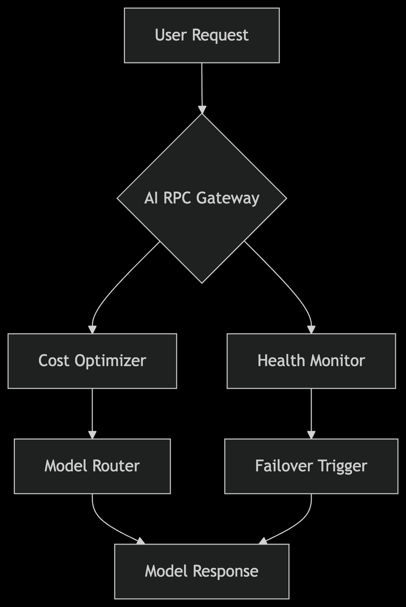

# 4EVER-Chat

[Chat with AI](https://chat.4everland.org/)

### Install the dependencies

```bash
# npm install -g yarn
yarn
```

### Start the app in development mode (hot-code reloading, error reporting, etc.)

```bash
yarn dev
```

### Build the app for production

```bash
npm run build
```

The Next-Generation AI Development Platform with Unified Interface for 300+ Models, API Key Management-Free, and Multi-Chain Payment Support

In the fast-paced world of AI model iterations, developers often find themselves locked into a single vendor's API, grappling with complex key management, service throttling, and fluctuating costs. Our solution, 4EVERChat, built on 4EVER AI RPC, offers:

✅ Vendor Flexibility: Instantly switch between around 300 models like ChatGPT, Deepseek, Grok, and more.

✅ Zero-Configuration Access: Automatically handles authentication, usage monitoring, and multi-chain payments (future billing support).

✅ Intelligent Routing Engine: Dynamically optimize costs and performance.
⚡ Real-Time Price Comparison: Route requests to the most cost-effective models.
🛡️ Automatic Disaster Recovery: Instantly switch to backup nodes in case of failures.

✅ Multi-Chain Payments: Support for BNB Chain, opBNB, Ethereum, and other public chain cryptocurrencies.

✅ Web3 Toolbox: Provide tools compatible with Web3, enabling on-chain information queries and interactions, supporting multi-chain operations, and integrating existing MCP tools like BNB Chain MCP.

Use Cases and Value Proposition

- Startups: Low-cost rapid prototyping and scalable model expansion on demand.
- Large Enterprises: Customized industry solutions (customer service/data analysis).
- Researchers: Comparative analysis of vertical domain models (code/scientific literature).

With 4EVERChat, unlock the potential of AI development without complexities.

Technical architecture：




