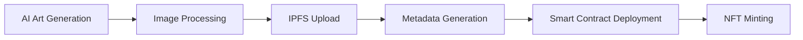

# BNB Chain AI NFT Art Generator Example

## Introduction

This example demonstrates how to create an AI-powered NFT art generator and minting system on BNB Chain. The project uses Stable Diffusion to generate unique artwork and provides a complete pipeline for turning these creations into NFTs with automated metadata handling and smart contract deployment.

## Key Features

Generate unique artwork using Stable Diffusion AI and mint them as NFTs on BNB Chain with:
- 🎨 AI-powered art generation with customizable parameters
- 🔗 Direct minting to BNB Chain (testnet & mainnet)
- 📊 OpenSea-compatible metadata generation and IPFS upload
- ⚙️ Gas-optimized smart contract implementation
- 🛠️ Complete CLI tools for end-to-end automation
- 🔄 Batch processing capabilities for collections

## Technical Architecture

### Components

1. **Art Generation Module** (`src/generators/`)
   - Integrates Stable Diffusion for AI art creation
   - Handles prompt generation and image processing
   - Optimized for both CPU and GPU environments

2. **Blockchain Integration** (`src/blockchain/`)
   - Smart contract deployment and interaction
   - Gas optimization strategies
   - Transaction management and retry logic

3. **NFT Standards** (`src/utils/`)
   - OpenSea-compatible metadata generation
   - IPFS content management
   - Collection management utilities

4. **CLI Interface** (`cli.py`)
   - Command-line tools for all operations
   - Batch processing capabilities
   - Progress tracking and error handling

### System Flow



### Key Technologies

- **Stable Diffusion**: For AI art generation
- **Web3.py**: For BNB Chain interaction
- **IPFS**: For decentralized storage
- **Solidity**: For smart contract development

## Prerequisites

- Python 3.8+
- BNB Chain wallet with BNB for gas
- (Optional) Local IPFS node for content storage
- (Optional) Pinata API key for IPFS pinning

## Installation

1. Clone this repository:
```bash
git clone <repository-url>
cd ai-nft-art-generator
```

2. Set up a Python virtual environment:
```bash
python -m venv .venv
source .venv/bin/activate  # On Windows: .venv\Scripts\activate
```

3. Install dependencies:
```bash
pip install -r requirements.txt
```

4. Configure your environment:
```bash
cp config/config.example.yml config/config.yml
# Edit config.yml with your settings
```

5. Set up environment variables:
```bash
cp .env.example .env
# Edit .env with your credentials
```

Required environment variables:
- `PRIVATE_KEY`: Your BNB Chain wallet private key
- `WALLET_ADDRESS`: Your BNB Chain wallet address
- (Optional) `PINATA_API_KEY`: Pinata API key
- (Optional) `PINATA_SECRET`: Pinata API secret

## Quick Start

Generate and mint your first NFT collection:

```bash
# Generate 5 unique artworks
python cli.py generate --count 5

# Upload to IPFS
python cli.py upload --collection ./output/latest

# Deploy the contract (first time only)
python cli.py deploy --network testnet

# Mint the NFTs
python cli.py mint --collection ./output/latest --contract YOUR_CONTRACT_ADDRESS
```

## Detailed Usage Guide

### Art Generation

Generate artwork with custom parameters:

```bash
# Generate with a specific prompt
python cli.py generate --prompt "abstract landscape, vibrant colors" --count 1

# Use a specific seed for reproducibility
python cli.py generate --prompt "cyberpunk city" --seed 42

# Batch generate a collection
python cli.py generate --count 10
```

### IPFS Upload

Upload your artwork and metadata to IPFS:

```bash
# Upload an entire collection
python cli.py upload --collection ./output/collection_123456

# Check upload status
cat ./output/collection_123456/ipfs_uploads.json
```

### Smart Contract Deployment

Deploy your NFT contract:

```bash
# Deploy to testnet
python cli.py deploy --network testnet

# Deploy to mainnet (requires mainnet BNB)
python cli.py deploy --network mainnet
```

### NFT Minting

Mint your NFTs:

```bash
# Mint an entire collection
python cli.py mint --collection ./output/latest --contract 0x...

# The minting process:
# 1. Uploads images to IPFS
# 2. Creates and uploads metadata
# 3. Mints NFTs on the blockchain
# 4. Saves transaction details
```

## Configuration Guide

### Stable Diffusion Settings

In `config.yml`:
```yaml
stable_diffusion:
  model_id: "runwayml/stable-diffusion-v1-5"
  prompt_prefix: "high quality, detailed, digital art"
  negative_prompt: "blurry, low quality, distorted"
  num_inference_steps: 50
  guidance_scale: 7.5
  image_size: 512
```

### Collection Settings

```yaml
collection:
  name: "AI Generated Art Collection"
  symbol: "AIGEN"
  description: "Unique AI-generated artwork collection"
  external_url: ""
  seller_fee_basis_points: 500  # 5% royalty
  fee_recipient: "0x..."  # Your wallet for royalties
```

### Blockchain Settings

```yaml
blockchain:
  network: "testnet"  # or "mainnet"
  gas_price_multiplier: 1.1  # For gas price optimization
  ipfs:
    gateway: "https://ipfs.io/ipfs/"
    api_url: "http://localhost:5001"  # Local node
```

## Advanced Features

### Custom Prompt Generation

The system generates unique prompts by combining:
- Art styles (digital art, oil painting, etc.)
- Subjects (landscape, portrait, etc.)
- Color schemes
- Modifiers (detailed, ethereal, etc.)

### Gas Price Optimization

Automatically calculates optimal gas prices using:
- Network conditions
- Configurable multiplier
- Historical gas prices

### Error Handling

Built-in retry mechanism for:
- IPFS uploads
- Blockchain transactions
- API calls

## Project Structure

```
ai-nft-art-generator/
├── config/                 # Configuration files
│   ├── config.example.yml # Example configuration
│   └── config.yml         # Your configuration
├── contracts/             # Smart contracts
│   ├── AiGeneratedNFT.sol # Main NFT contract
│   └── abi/              # Contract ABIs
├── src/                   # Source code
│   ├── generators/        # Art generation
│   ├── blockchain/        # Chain interaction
│   └── utils/            # Utilities
├── scripts/              # Helper scripts
├── output/               # Generated content
└── cli.py               # Command line interface
```

## Troubleshooting

### Common Issues

1. IPFS Upload Fails
   - Check local IPFS node status
   - Verify Pinata API credentials
   - Check file sizes

2. Minting Fails
   - Ensure sufficient BNB for gas
   - Verify contract address
   - Check network connection

3. Generation Issues
   - Check CUDA availability
   - Verify model download
   - Check available memory

## License

MIT

## Contributing

Contributions are welcome! Please read our [contributing guidelines](CONTRIBUTING.md) before submitting PRs.

## Support

- Open an issue for bugs
- Join our Discord community
- Check the [FAQ](docs/FAQ.md)