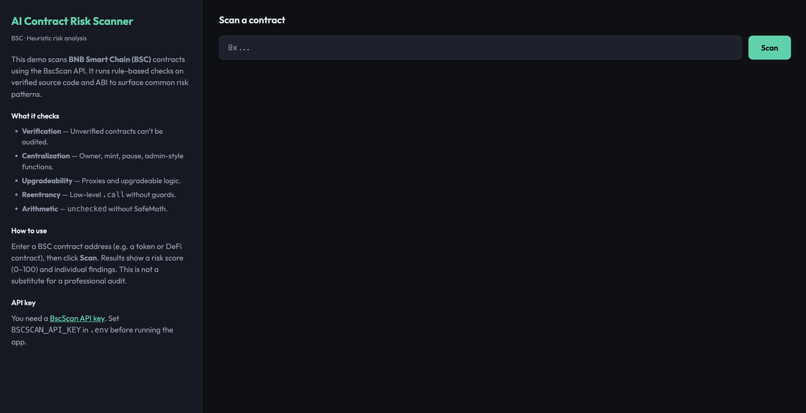

# AI Contract Risk Scanner

A small BNB Smart Chain (BSC) demo that scans smart contract addresses via the **BSCTrace API (MegaNode)** and runs **bytecode-based heuristic risk analysis**. Use it to quickly spot common risk patterns before interacting with a contract.



---

## What it does

- **Fetches** contract bytecode and creation tx from [BSCTrace API](https://docs.nodereal.io/docs/migrating-from-bscscan) (MegaNode) on BSC mainnet.
- **Analyzes** bytecode for delegatecall/proxy patterns, self-destruct, CREATE/CREATE2, and size-based complexity.
- **Reports** a 0–100 risk score and individual findings in a dark-mode UI.

This is **not** a replacement for a professional audit. It is a learning tool and a first-pass checklist. Source code and ABI are not used; analysis is bytecode-only.

---

## Tech stack

- **TypeScript** (Node 18+)
- **Express** — HTTP server and `/api/scan` endpoint
- **Single-page UI** — `frontend.html` (vanilla JS, dark theme)
- **BSCTrace API (MegaNode)** — `eth_getCode`, `nr_getContractCreationTransaction`

---

## Quick start

### 1. Clone and run (recommended)

From the project directory:

```bash
chmod +x clone-and-run.sh
./clone-and-run.sh
```

The script installs deps, seeds `.env` from `.env.example`, runs tests, and starts the app. Open [http://localhost:3333](http://localhost:3333).

### 2. Manual setup

```bash
npm install
cp .env.example .env
# Edit .env: set BSCTRACE_API_KEY (get a free key at https://dashboard.nodereal.io/)
npm run build
npm test
npm start
```

Then open [http://localhost:3333](http://localhost:3333).

---

## API key

Scanning requires a [MegaNode API key](https://dashboard.nodereal.io/) (BSCTrace API). Set `BSCTRACE_API_KEY` in `.env`. Without it, the UI will show an error when you run a scan.

---

## Project layout

| File            | Purpose                                              |
|-----------------|------------------------------------------------------|
| `app.ts`        | Express server, BSCTrace/MegaNode client, risk logic |
| `frontend.html` | Dark-mode UI (left: info, right: scanner)            |
| `app.test.ts`   | Unit tests for all risk and helper functions         |
| `clone-and-run.sh` | One-command setup and run                         |
| `README.md`     | This file                                            |

---

## API

- `GET /` — Serves the UI.
- `GET /api/scan?address=0x...` — Scans the given BSC contract address. Returns JSON:

  ```json
  {
    "address": "0x...",
    "contractName": null,
    "verified": true,
    "score": 75,
    "scoreLabel": "Medium risk",
    "findings": [
      { "level": "medium", "label": "...", "description": "..." }
    ],
    "meta": { "creator": "0x...", "creationTxHash": "0x..." }
  }
  ```

---

## License

MIT.
