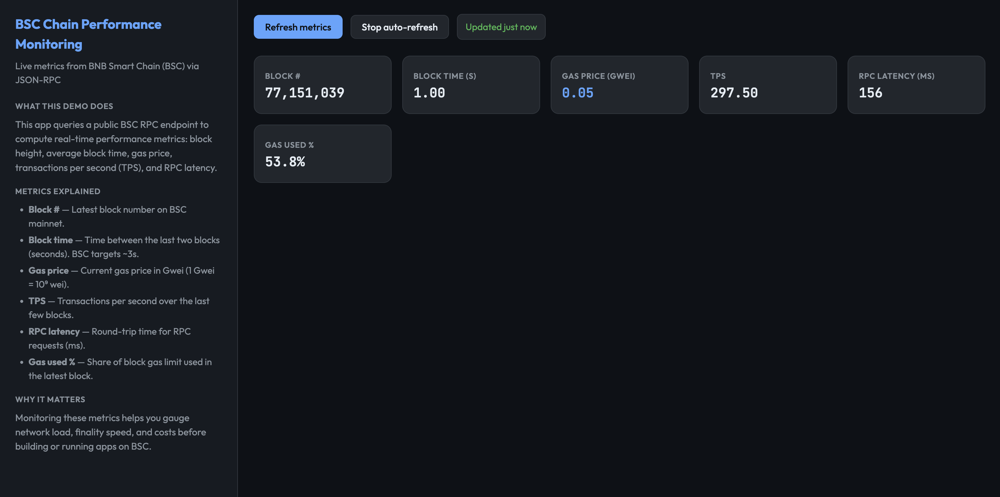

# BSC Chain Performance Monitoring

A small BNB Smart Chain (BSC) demo that fetches live performance metrics from a public RPC and displays them in a dark-mode UI.



---

## What it does

- **Block #** — Latest BSC mainnet block number
- **Block time** — Time between the last two blocks (seconds)
- **Gas price** — Current gas price in Gwei
- **TPS** — Transactions per second over recent blocks
- **RPC latency** — Round-trip time for RPC requests (ms)
- **Gas used %** — Share of block gas limit used in the latest block

The app uses standard JSON-RPC (`eth_blockNumber`, `eth_getBlockByNumber`, `eth_gasPrice`) against a public BSC endpoint.

---

## Tech stack

- **TypeScript** — App and tests
- **Express** — HTTP server and `/api/metrics`
- **Plain HTML/CSS/JS** — Frontend (dark theme, info + interaction panes)

---

## Quick start

### Option 1: Clone and run script (recommended)

```bash
git clone <this-repo>
cd chain-performance-monitoring
chmod +x clone-and-run.sh
./clone-and-run.sh
```

The script creates a `.env` with a working RPC URL, installs deps, runs tests, and starts the server. Open http://localhost:3000.

### Option 2: Manual

```bash
cd chain-performance-monitoring
cp .env.example .env   # or create .env with BSC_RPC_URL and optionally PORT
npm install
npm run build
npm test
npm start
```

Then open http://localhost:3000.

---

## Env vars

| Variable       | Default                          | Description                |
|----------------|----------------------------------|----------------------------|
| `BSC_RPC_URL`  | `https://bsc-dataseed.bnbchain.org` | BSC JSON-RPC endpoint  |
| `PORT`         | `3000`                           | HTTP server port           |

---

## Scripts

- `npm run build` — Compile TypeScript to `dist/`
- `npm start` — Run `node dist/app.js`
- `npm test` — Run unit tests (Vitest)

---

## Project layout

```
chain-performance-monitoring/
├── clone-and-run.sh
├── package.json
├── README.md
├── public/
│   └── index.html    # Frontend
├── src/
│   └── app.ts        # Express app, BSC RPC client, metrics API
├── tests/
│   └── app.test.ts   # Unit tests
└── tsconfig.json
```

---

## License

MIT
