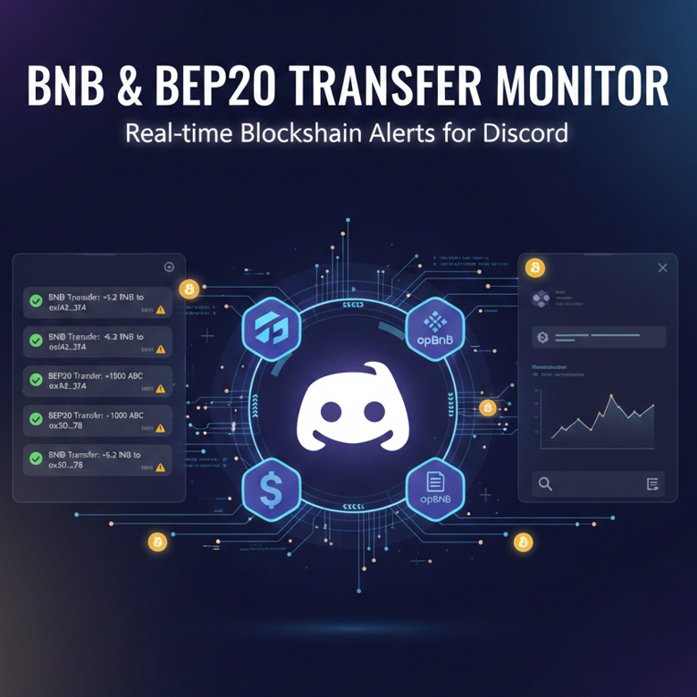
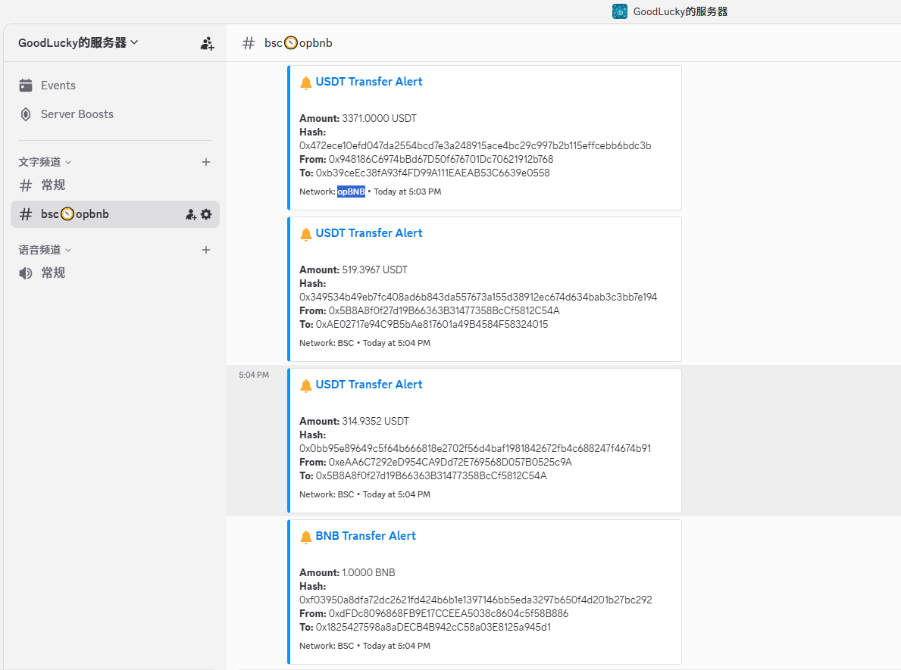
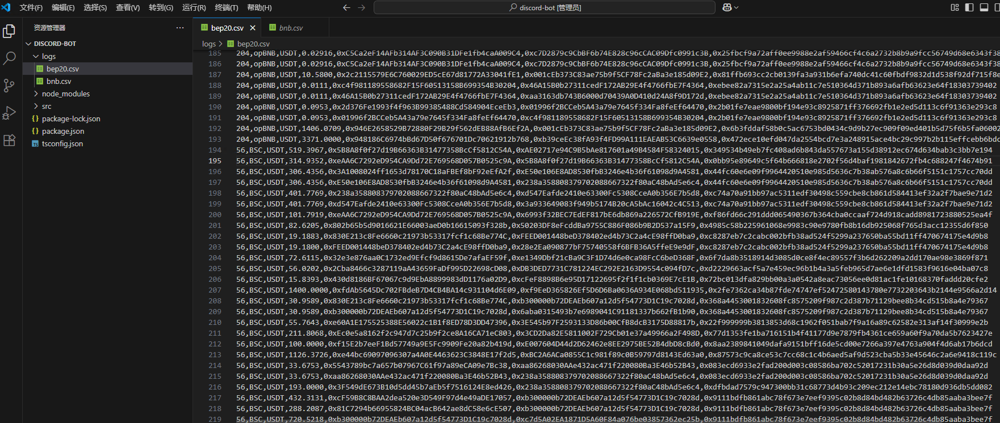
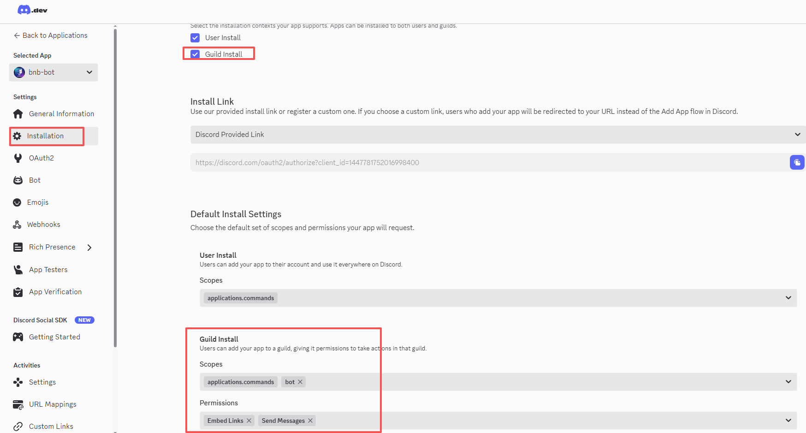
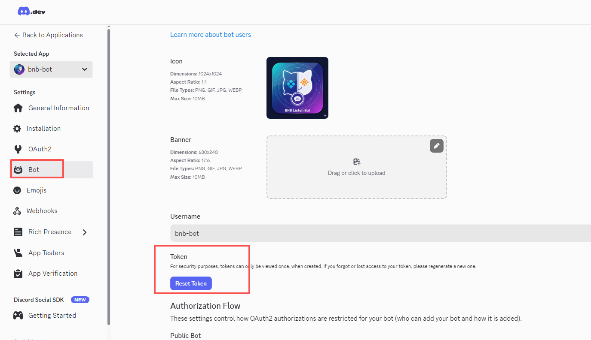
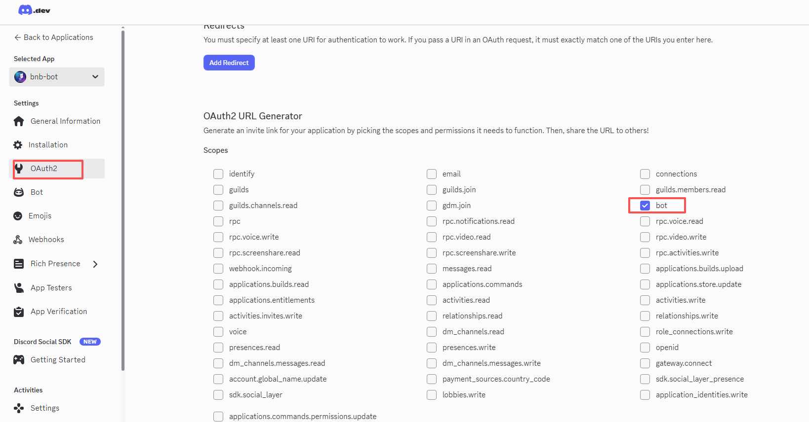
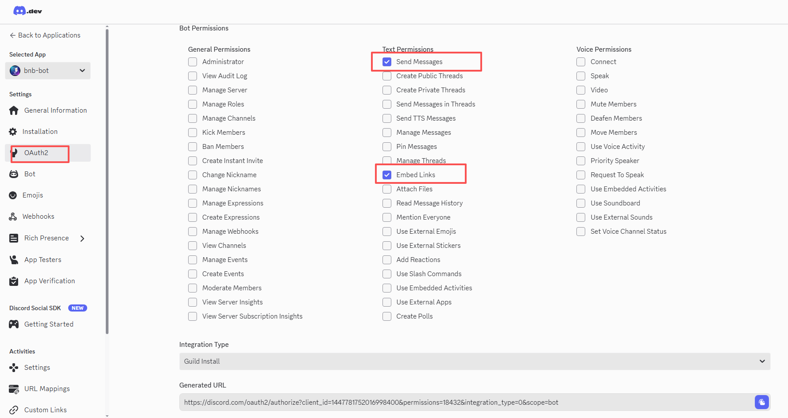
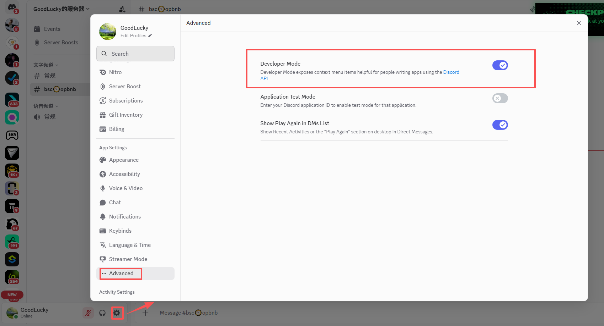
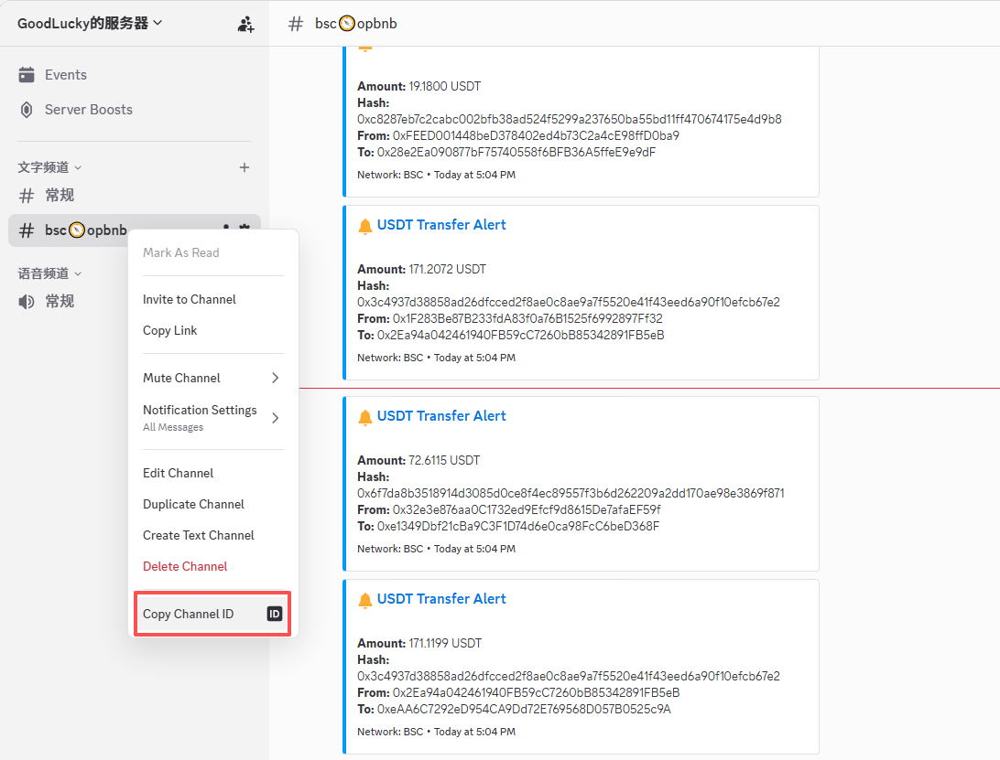

# 💸 BNB & BEP20 Transfer Monitoring Discord Bot

A powerful Discord bot designed for **Binance Smart Chain (BSC)** and **opBNB**, used to real-time monitor on-chain transactions and **BEP20 token transfer** events, instantly sending alerts to the configured Discord channel.

It uses [Ethers.js](https://docs.ethers.org/v6/) to listen for two key transaction types:
1. **Native Token Transfers**: Monitoring **BNB** transactions on the BSC/opBNB chains.
2. **BEP20 Token Transfers**: Monitoring the `Transfer` events emitted by token smart contracts.

All alerts are instantly pushed to Discord, and all processed transactions can be logged to a local CSV file (optional).



---

## 💡 Key Features (Features)

* **Dual-Chain Support**: Monitors **BSC** and **opBNB** networks simultaneously.
* **Real-time Alerts**: Instantly pushes monitored transactions to the specified Discord text channel.
* **Multi-Contract Monitoring**: Configurable to monitor multiple BEP-20 contracts.
* **Flexible Filters**: Supports filtering BNB and BEP20 token transfers by addresses (`froms`, `tos`) or minimum amount (`min_value`).
* **Optional Logging**: Supports logging all alert transactions to a local CSV file.

---

## 🛠️ Prerequisites (Prerequisites)

You need to prepare the following environment and credentials:

* **Node.js**: Version **18 or higher** (LTS recommended).
* **npm or Yarn**: Node.js package manager.
* **Stable WebSocket RPC URL**:
    * You need to obtain stable, private **WebSocket (WSS)** endpoints for both the BSC and opBNB networks.
    * **Important Note**: Public endpoints are generally unreliable and unsuitable for continuous monitoring. It is recommended to use professional WSS services from platforms like [Infura](https://infura.io/), [Alchemy](https://www.alchemy.com/), [QuickNode](https://www.quicknode.com/).
* **Discord Bot Token**: The token for your Discord application bot.
    * Reference: [Discord Developer Starter Guide](https://discordjs.guide/legacy/preparations/app-setup).
* **Discord Channel ID**: The specific **text channel** ID used for sending alerts.


---

## 🚀 Installation & Setup

### 1. Install Global Dependencies

Globally install `typescript`, `tsx`, `pm2` to support project execution:

```bash
npm install -g typescript
npm install -g tsx
npm install -g pm2
````

### 2\. Clone the Project

Clone the repository and navigate into the project directory:

```bash
git clone https://github.com/web3cli/example-hub.git
cd example-hub/typescript/discord-bot
```

### 3\. Install Project Dependencies

```bash
npm install
```

### 4\. Configure `config.ts`

Update the settings in the `config.ts` file with your environment information:

  * **Discord Credentials**:
      * Set `discord.bot_token` and `discord.channel_id`.
  * **RPC Endpoints**:
      * Set `bsc.rpc_wss_url` and `opbnb.rpc_wss_url` (must be WebSocket type).
  * **BEP20 Contracts and Monitoring Filters**: Configure `bsc.contracts` and `opbnb.contracts`, defining contract addresses and detailed monitoring rules.

| Monitoring Target | Configuration Path | Filtering Rules |
| :--- | :--- | :--- |
| **Native Token (BNB)** | `bsc.bnb` / `opbnb.bnb` | Filter by addresses (`froms`, `tos`) or minimum amount (`min_value`). |
| **BEP20 Tokens** | `bsc.contracts` / `opbnb.contracts` | Includes token address (`address`) and corresponding filtering rules (`froms`, `tos`, `min_value`) for the `Transfer` event. |

-----

## ▶️ Running the Project (Running the Project)

Use the following commands to run, compile, and manage the project:

| Command | Description | Purpose |
| :--- | :--- | :--- |
| `npm run dev` | Local Start | Suitable for development and testing, supports hot reloading. |
| `npm run build` | Compile Project | Compiles TypeScript source code into JavaScript. |
| `npm run start` | Production Start | Runs the compiled JavaScript file in a production environment. |
| `npm run restart` | Production Restart | For restarting the deployed production service. |
| `npm run stop` | Production Stop | Stops the running service in the production environment. |

-----

## 📸 Screenshots and Configuration Reference

1.  Running Snapshot
    


2.  CSV Log Recording
    


3.  Discord Bot Settings
    


4.  Obtaining Discord Token
    


5.  Obtaining Discord OAuth2 URL
    
    


6.  Discord Developer Mode
    


7.  Obtaining Discord Channel ID
    
