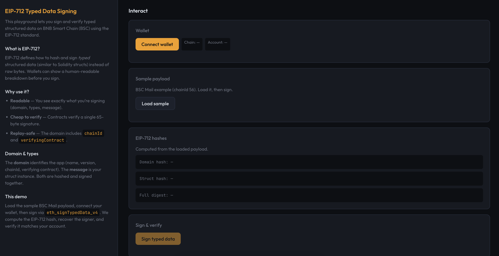

# EIP-712 Typed Data Signing Playground

A small **BNBChain Cookbook** demo for **EIP-712** typed structured data hashing and signing on **BNB Smart Chain (BSC)**. Sign and verify typed data in the browser with a Web3 wallet (e.g. MetaMask).

## Screenshot



## What it does

- **Left pane:** Short explainer on EIP-712, domain separation, and what the demo does.
- **Right pane:** Connect wallet → load a BSC Mail sample → view EIP-712 hashes (domain, struct, full digest) → sign via `eth_signTypedData_v4` → verify and recover signer.

## Tech stack

- **TypeScript**
- **ethers** v6 (hashing, verification)
- **Vite** (build + dev server)
- **Vitest** (unit tests)

## Quick start

```bash
npm install
npm run dev
```

Open the dev server URL (e.g. `http://localhost:5173`), connect a wallet on BSC (or any chain for the demo), load the sample, and sign.

## Scripts

| Command       | Description                |
|---------------|----------------------------|
| `npm run dev` | Start Vite dev server      |
| `npm run build` | Production build         |
| `npm run preview` | Serve `dist/`          |
| `npm test`    | Run Vitest unit tests      |

## Clone & run (evaluators)

Use the provided script for a no-friction run with a pre-seeded `.env`:

```bash
./clone-and-run.sh
```

This installs deps, creates `.env` from `.env.example`, runs tests, builds, and starts the dev server.

## Project layout

- `src/app.ts` — EIP-712 logic (hash, domain, struct, verify, payload).
- `src/frontend.ts` — UI (dark theme, info + interaction panes).
- `index.html` — Entry page.
- `tests/app.test.ts` — Unit tests for all app functions.

## License

MIT.
