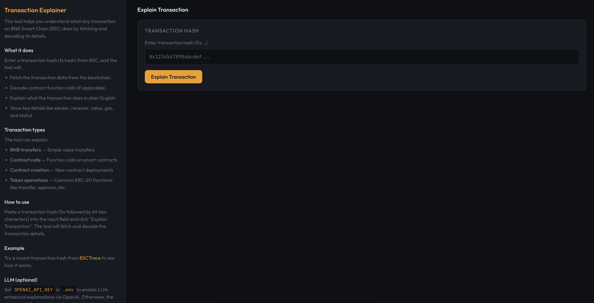

# Transaction Explainer

A small BNB Smart Chain (BSC) demo that fetches and explains what any transaction does. Enter a transaction hash to get a human-readable explanation of the transaction's purpose, decode contract function calls, and view key transaction details.



---

## What it does

- **Fetches** transaction data from BSC using JSON-RPC (via backend `/api/explain`)
- **Decodes** contract function calls (transfer, approve, swap, etc.)
- **Explains** what the transaction does in plain English (default rule-based)
- **Optional LLM** — Set `OPENAI_API_KEY` in `.env` to enhance explanations with OpenAI; otherwise uses the default rule-based explanation
- **Displays** key details: sender, receiver, value, gas, status, and more

This tool helps you understand blockchain transactions without needing to manually decode hex data or read contract ABIs.

---

## Tech stack

- **TypeScript** — App logic and tests
- **Express** — Backend server, serves SPA and `/api/explain`
- **ethers v6** — RPC client and transaction parsing
- **Vite** — Build tool and dev server
- **Vitest** — Unit testing
- **OpenAI** (optional) — LLM-enhanced explanations when `OPENAI_API_KEY` is set

---

## Quick start

### Option 1: Clone and run script (recommended)

```bash
git clone <this-repo>
cd explain-this-tx-example
chmod +x clone-and-run.sh
./clone-and-run.sh
```

The script installs dependencies, creates `.env` from `.env.example`, runs tests, builds, and starts the server. Open **http://localhost:3000** (or the `PORT` in `.env`).

### Option 2: Manual setup

```bash
cd explain-this-tx-example
cp .env.example .env
# Optional: set OPENAI_API_KEY for LLM-enhanced explanations
# Optional: set BSC_RPC_URL, PORT
npm install
npm run build
npm test
npm start
```

Then open **http://localhost:3000** (or your `PORT`). Use `npm run dev` for Vite-only frontend dev (no `/api`; run `npm run server` separately for the API).

---

## Environment variables

| Variable | Default | Description |
|----------|---------|-------------|
| `VITE_BSC_RPC_URL` | `https://bsc-dataseed.bnbchain.org` | BSC JSON-RPC endpoint (frontend / legacy) |
| `BSC_RPC_URL` | same as above | BSC JSON-RPC endpoint used by backend |
| `PORT` | `3000` | HTTP server port |
| `OPENAI_API_KEY` | — | **Optional.** Set to enable LLM-enhanced explanations (OpenAI). Otherwise uses default rule-based explanation. |

---

## Scripts

| Command | Description |
|---------|-------------|
| `npm start` | Build SPA and run Express server (serves `dist/` + `/api/explain`) |
| `npm run server` | Run Express server only (assumes `dist/` exists) |
| `npm run dev` | Vite dev server (frontend only; no `/api` unless server runs separately) |
| `npm run build` | Production build |
| `npm run preview` | Vite preview of `dist/` |
| `npm test` | Run Vitest unit tests |

---

## Project layout

```
explain-this-tx-example/
├── clone-and-run.sh
├── package.json
├── README.md
├── index.html              # Entry page
├── server.ts               # Express server: serves SPA, /api/explain, optional OpenAI
├── src/
│   ├── app.ts              # Transaction fetching and explanation logic
│   └── frontend.ts         # UI (dark theme, info + interaction panes)
├── tests/
│   └── app.test.ts         # Unit tests
└── tsconfig.json
```

---

## How it works

1. **Input validation** — Validates the transaction hash format (0x + 64 hex chars)
2. **API call** — Frontend POSTs to `/api/explain` with the tx hash; backend fetches and explains
3. **RPC fetch** — Backend uses `eth_getTransaction` and `eth_getTransactionReceipt` to fetch transaction data
4. **Decoding** — Attempts to decode contract function calls using common function selectors
5. **Explanation** — Builds a human-readable explanation (rule-based). If `OPENAI_API_KEY` is set, optionally enhances with OpenAI (LLM). Covers:
   - Simple BNB transfers
   - Contract function calls (with decoded function names and parameters)
   - Contract creation
   - Token operations (transfer, approve, etc.)
6. **Display** — Shows explanation, transaction details, and a link to BSCTrace

---

## Supported function types

The tool recognizes common ERC-20 and DEX functions:
- `transfer(address,uint256)`
- `transferFrom(address,address,uint256)`
- `approve(address,uint256)`
- `mint(address,uint256)`
- `burn(uint256)`
- `swapExactETHForTokens(...)`
- `swapExactTokensForTokens(...)`
- And more...

For unknown functions, it shows the function selector and raw data.

---

## License

MIT.
