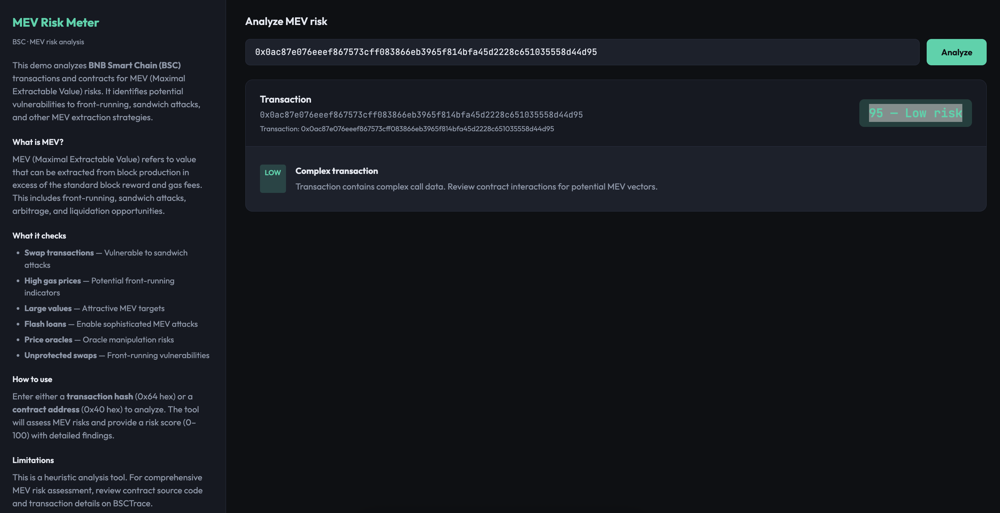

# MEV Risk Meter

A small BNB Smart Chain (BSC) demo that analyzes transactions and contracts for MEV (Maximal Extractable Value) risks. Use it to identify potential vulnerabilities to front-running, sandwich attacks, and other MEV extraction strategies.



---

## What it does

- **Analyzes transactions** — Checks for swap operations, high gas prices, and large values that make transactions attractive MEV targets
- **Analyzes contracts** — Identifies swap functions, flash loan capabilities, price oracle dependencies, and unprotected operations
- **Risk scoring** — Provides a 0–100 risk score with detailed findings for each detected MEV vector
- **Real-time analysis** — Fetches live transaction and contract data from BSC RPC endpoints

This tool helps developers and users understand MEV risks before interacting with contracts or submitting transactions on BSC.

---

## What is MEV?

MEV (Maximal Extractable Value) refers to value that can be extracted from block production in excess of the standard block reward and gas fees. Common MEV strategies include:

- **Front-running** — Submitting a transaction with higher gas price to execute before a target transaction
- **Sandwich attacks** — Placing transactions before and after a target swap to profit from price impact
- **Arbitrage** — Exploiting price differences across DEXs or markets
- **Liquidation** — Liquidating undercollateralized positions for profit

---

## Tech stack

- **TypeScript** (Node 18+)
- **Express** — HTTP server and `/api/analyze` endpoint
- **Single-page UI** — `frontend.html` (vanilla JS, dark theme)
- **BSC JSON-RPC** — Transaction and contract data fetching

---

## Quick start

### 1. Clone and run (recommended)

From the project directory:

```bash
chmod +x clone-and-run.sh
./clone-and-run.sh
```

The script installs deps, seeds `.env` from `.env.example`, runs tests, and starts the app. Open [http://localhost:3000](http://localhost:3000).

### 2. Manual setup

```bash
npm install
cp .env.example .env
# Edit .env if needed (default RPC URL is already set)
npm run build
npm test
npm start
```

Then open [http://localhost:3000](http://localhost:3000).

---

## Environment variables

| Variable       | Default                          | Description                |
|----------------|----------------------------------|----------------------------|
| `BSC_RPC_URL`  | `https://bsc-dataseed.bnbchain.org` | BSC JSON-RPC endpoint  |
| `PORT`         | `3000`                           | HTTP server port           |

---

## Project layout

| File            | Purpose                                      |
|-----------------|----------------------------------------------|
| `app.ts`        | Express server, RPC client, MEV risk logic  |
| `frontend.html` | Dark-mode UI (left: info, right: analyzer)  |
| `app.test.ts`   | Unit tests for all MEV analysis functions   |
| `clone-and-run.sh` | One-command setup and run                 |
| `README.md`     | This file                                    |

---

## API

- `GET /` — Serves the UI.
- `GET /api/analyze?input=0x...` — Analyzes the given transaction hash or contract address. Returns JSON:

  ```json
  {
    "address": "0x...",
    "riskScore": 75,
    "riskLabel": "Medium risk",
    "findings": [
      { "level": "high", "label": "Swap transaction detected", "description": "..." }
    ],
    "transactionHash": "0x...",
    "contractType": "Transaction"
  }
  ```

---

## How it works

### Transaction Analysis

- **Swap detection** — Identifies common DEX swap function signatures
- **Gas price analysis** — Flags transactions with gas prices >20% above current average
- **Value analysis** — Identifies transactions with significant value (>0.1 BNB)

### Contract Analysis

- **Function detection** — Scans ABI for swap, flash loan, and oracle functions
- **Risk assessment** — Evaluates unprotected operations and centralization risks
- **Pattern matching** — Identifies common MEV-vulnerable patterns

---

## Limitations

This is a heuristic analysis tool and **not** a replacement for:

- Professional security audits
- Comprehensive MEV risk assessments
- On-chain monitoring and simulation

For production use, review contract source code on BSCTrace and use specialized MEV analysis tools.

---

## License

MIT.
