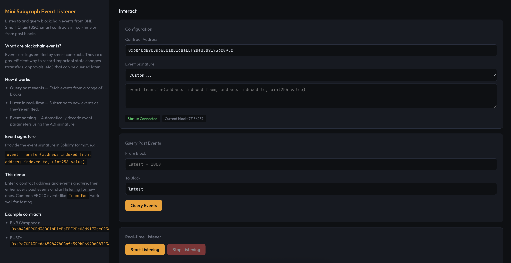

# Mini Subgraph Event Listener

A small **BNBChain Cookbook** demo for listening to and querying blockchain events from **BNB Smart Chain (BSC)** smart contracts. Query past events or listen in real-time as new events are emitted.



## What it does

- **Query past events** — Fetch events from a specified block range on BSC.
- **Real-time listening** — Subscribe to new events as they're emitted on-chain.
- **Event parsing** — Automatically decode event parameters using Solidity event signatures.
- **Dark-mode UI** — Modern interface with left info pane and right interaction pane.

## Tech stack

- **TypeScript**
- **ethers.js v6** — Blockchain interaction and event parsing
- **Vite** — Build + dev server
- **Vitest** — Unit tests

## Quick start

### 1. Clone and run (recommended)

From the project directory:

```bash
chmod +x clone-and-run.sh
./clone-and-run.sh
```

The script installs deps, seeds `.env` from `.env.example`, runs tests, and starts the dev server. Open the dev server URL (e.g. `http://localhost:5173`).

### 2. Manual setup

```bash
npm install
cp .env.example .env
# Edit .env if needed (VITE_BSC_RPC_URL is optional, defaults to public BSC RPC)
npm test
npm run dev
```

Then open the dev server URL (e.g. `http://localhost:5173`).

## Usage

1. **Enter contract address** — Use a BSC contract address (e.g., WBNB: `0xbb4CdB9CBd36B01bD1cBaEBF2De08d9173bc095c`).
2. **Select or enter event signature** — Choose from sample events or enter a custom one in Solidity format:
   ```
   event Transfer(address indexed from, address indexed to, uint256 value)
   ```
3. **Query past events** — Specify block range and click "Query Events".
4. **Listen in real-time** — Click "Start Listening" to receive new events as they're emitted.

## Example contracts

- **WBNB (Wrapped BNB)**: `0xbb4CdB9CBd36B01bD1cBaEBF2De08d9173bc095c`
- **BUSD**: `0xe9e7CEA3DedcA5984780Bafc599bD69ADd087D56`

Both support standard ERC20 events like `Transfer` and `Approval`.

## Scripts

| Command       | Description                |
|---------------|----------------------------|
| `npm run dev` | Start Vite dev server      |
| `npm run build` | Production build         |
| `npm run preview` | Serve `dist/`          |
| `npm test`    | Run Vitest unit tests      |

## Project layout

- `src/app.ts` — Core event listening and querying logic.
- `src/frontend.ts` — UI (dark theme, info + interaction panes).
- `index.html` — Entry page.
- `tests/app.test.ts` — Unit tests for all app functions.

## License

MIT.
