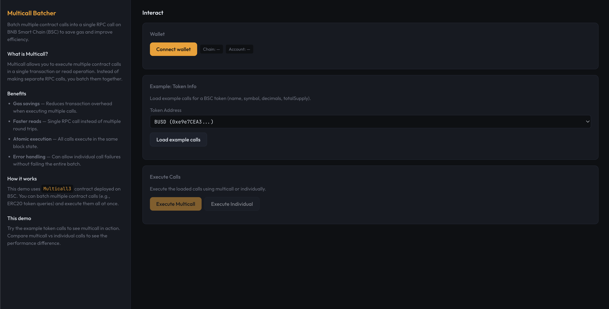

# Multicall Batcher Example

A small BNB Smart Chain (BSC) demo that demonstrates how to batch multiple contract calls into a single RPC call using multicall contracts, saving gas and improving efficiency.



---

## What it does

- **Batch contract calls** — Combine multiple contract calls into a single multicall execution
- **Gas savings** — Reduce transaction overhead by batching calls together
- **Performance comparison** — Compare multicall vs individual calls to see the difference
- **Token examples** — Pre-configured examples for popular BSC tokens (BUSD, USDT, USDC, WBNB)
- **Real-time results** — See decoded results from your batched calls

The app uses the Multicall3 contract deployed on BSC mainnet to execute batched contract calls efficiently.

---

## Tech stack

- **TypeScript** — App and tests
- **Vite** — Build tool and dev server
- **Ethers.js v6** — Blockchain interaction
- **Plain HTML/CSS/JS** — Frontend (dark theme, info + interaction panes)
- **Vitest** — Unit testing

---

## Quick start

### Option 1: Clone and run script (recommended)

```bash
git clone <this-repo>
cd multicall-batcher-example
chmod +x clone-and-run.sh
./clone-and-run.sh
```

The script creates a `.env` with a working RPC URL, installs deps, runs tests, and starts the dev server. Open http://localhost:5173.

### Option 2: Manual

```bash
cd multicall-batcher-example
cp .env.example .env   # or create .env with VITE_BSC_RPC_URL
npm install
npm test
npm run dev
```

Then open http://localhost:5173.

---

## Env vars

| Variable            | Default                          | Description                |
|---------------------|----------------------------------|----------------------------|
| `VITE_BSC_RPC_URL`  | `https://bsc-dataseed.bnbchain.org` | BSC JSON-RPC endpoint  |

---

## Scripts

- `npm run dev` — Start Vite dev server
- `npm run build` — Build for production
- `npm run preview` — Preview production build
- `npm test` — Run unit tests (Vitest)

---

## Project layout

```
multicall-batcher-example/
├── src/
│   ├── app.ts          # Core multicall logic
│   └── frontend.ts     # UI implementation
├── tests/
│   └── app.test.ts     # Unit tests
├── index.html          # Entry point
├── package.json        # Dependencies
├── tsconfig.json       # TypeScript config
├── vite.config.ts      # Vite config
├── vitest.config.ts    # Vitest config
├── clone-and-run.sh    # Quick start script
└── README.md           # This file
```

---

## How multicall works

1. **Encode calls** — Each contract call is encoded with its target address and call data
2. **Batch execution** — All calls are sent to the Multicall3 contract in a single transaction
3. **Atomic execution** — All calls execute against the same block state
4. **Results** — Returns success status and return data for each call

### Example use cases

- Fetching multiple token balances in one call
- Querying multiple contract states simultaneously
- Reducing RPC round trips for better performance
- Saving gas when executing multiple operations

---

## Testing

All functions are covered by unit tests. Run tests with:

```bash
npm test
```

Tests verify:
- Call encoding and decoding
- Example call generation
- Gas savings estimation
- Address validation
- ABI compatibility

---

## License

MIT
