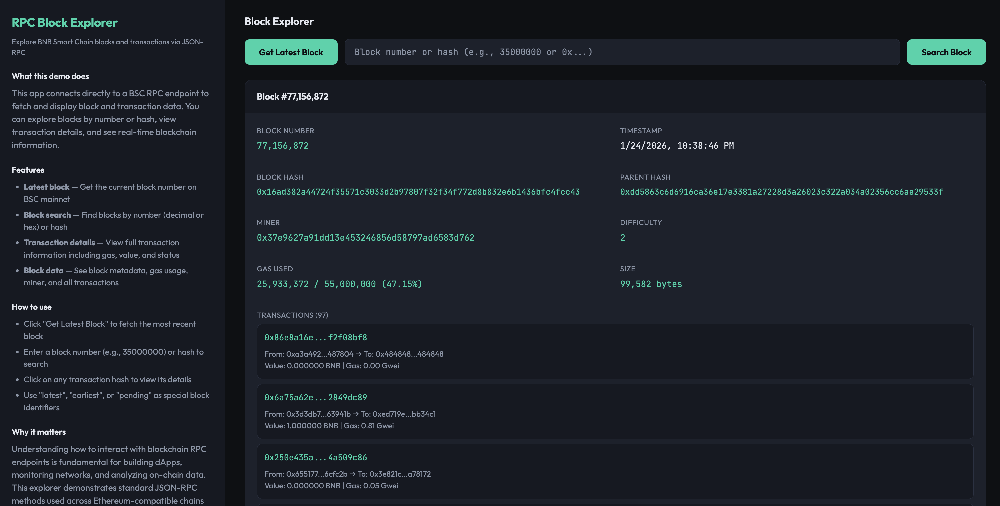

# RPC Block Explorer

A small BNB Smart Chain (BSC) demo that explores blocks and transactions via direct JSON-RPC calls. Search blocks by number or hash, view transaction details, and see real-time blockchain data.



---

## What it does

- **Latest block** — Get the current block number on BSC mainnet
- **Block search** — Find blocks by number (decimal or hex) or hash
- **Transaction details** — View full transaction information including gas, value, and status
- **Block data** — See block metadata, gas usage, miner, and all transactions
- **Direct RPC** — Uses standard JSON-RPC methods (`eth_blockNumber`, `eth_getBlockByNumber`, `eth_getTransactionByHash`)

The app connects directly to a public BSC RPC endpoint and demonstrates how to interact with blockchain data using standard Ethereum-compatible JSON-RPC methods.

---

## Tech stack

- **TypeScript** — App and tests
- **Express** — HTTP server and API endpoints
- **Plain HTML/CSS/JS** — Frontend (dark theme, info + interaction panes)
- **JSON-RPC** — Direct blockchain queries via BSC RPC endpoint

---

## Quick start

### Option 1: Clone and run script (recommended)

```bash
git clone <this-repo>
cd rpc-block-explorer-example
chmod +x clone-and-run.sh
./clone-and-run.sh
```

The script creates a `.env` with a working RPC URL, installs deps, runs tests, and starts the server. Open http://localhost:3000.

### Option 2: Manual

```bash
cd rpc-block-explorer-example
cp .env.example .env   # or create .env with BSC_RPC_URL and optionally PORT
npm install
npm run build
npm test
npm start
```

Then open http://localhost:3000.

---

## Env vars

| Variable       | Default                          | Description                |
|----------------|----------------------------------|----------------------------|
| `BSC_RPC_URL`  | `https://bsc-dataseed.bnbchain.org` | BSC JSON-RPC endpoint  |
| `PORT`         | `3000`                           | HTTP server port           |

---

## API endpoints

- `GET /` — Frontend UI
- `GET /api/latest` — Get latest block number
- `GET /api/block/:input` — Get block by number or hash (e.g., `/api/block/35000000` or `/api/block/latest`)
- `GET /api/transaction/:hash` — Get transaction by hash

---

## Scripts

- `npm run build` — Compile TypeScript to `dist/`
- `npm start` — Run `node dist/app.js`
- `npm test` — Run unit tests (Vitest)

---

## Project layout

```
rpc-block-explorer-example/
├── app.ts              # Express server, RPC client, block/transaction logic
├── frontend.html       # Dark-mode UI (left: info, right: explorer)
├── app.test.ts        # Unit tests
├── clone-and-run.sh   # One-command setup script
├── package.json       # Dependencies and scripts
├── tsconfig.json      # TypeScript config
├── vitest.config.ts   # Test config
└── README.md          # This file
```

---

## Features

- **Block exploration** — Search by number, hash, or special identifiers (`latest`, `earliest`, `pending`)
- **Transaction viewing** — Click any transaction hash to see full details
- **Real-time data** — Direct queries to BSC mainnet
- **Gas metrics** — View gas used, gas limit, and gas prices
- **Value formatting** — Automatic conversion from wei to BNB and Gwei

---

## How it works

The app uses standard JSON-RPC methods:

1. **`eth_blockNumber`** — Get the latest block number
2. **`eth_getBlockByNumber`** — Fetch block data with optional transaction details
3. **`eth_getTransactionByHash`** — Get transaction details by hash
4. **`eth_getTransactionReceipt`** — Get transaction status (success/failed)

All data is fetched directly from the BSC RPC endpoint without any intermediate services or APIs.

---

## Testing

Run the test suite:

```bash
npm test
```

Tests cover:
- Hex number conversions
- Wei to BNB/Gwei formatting
- Block input validation and normalization
- RPC call handling
- Block and transaction fetching

---

## Notes

- The app uses a public BSC RPC endpoint. For production use, consider using your own RPC provider or a service like Infura, Alchemy, or QuickNode.
- Some blocks may have many transactions. The UI displays all transactions, but very large blocks may take longer to load.
- Transaction status (success/failed) is fetched from the transaction receipt, which may not be available for pending transactions.
