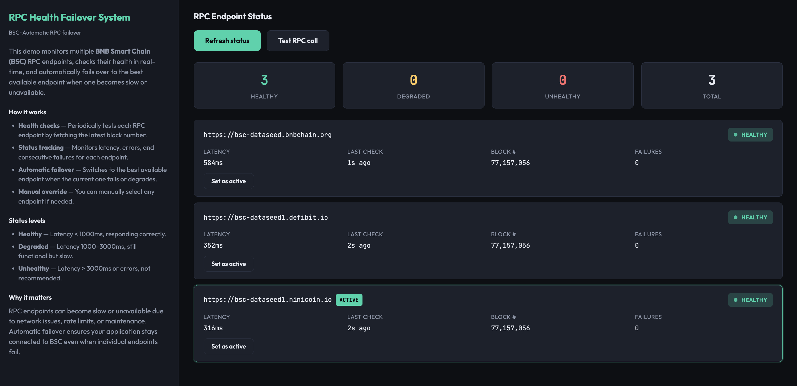

# RPC Health Failover System

A small BNB Smart Chain (BSC) demo that monitors multiple RPC endpoints, checks their health in real-time, and automatically fails over to the best available endpoint when one becomes slow or unavailable.



---

## What it does

- **Monitors** multiple BSC RPC endpoints simultaneously
- **Health checks** — Periodically tests each endpoint by fetching the latest block number
- **Status tracking** — Monitors latency, errors, and consecutive failures for each endpoint
- **Automatic failover** — Switches to the best available endpoint when the current one fails or degrades
- **Manual override** — Allows you to manually select any endpoint if needed
- **Real-time UI** — Dark-mode dashboard showing status of all endpoints

The system categorizes endpoints into three status levels:
- **Healthy** — Latency < 1000ms, responding correctly
- **Degraded** — Latency 1000–3000ms, still functional but slow
- **Unhealthy** — Latency > 3000ms or errors, not recommended

---

## Tech stack

- **TypeScript** — App and tests
- **Express** — HTTP server and API endpoints
- **Plain HTML/CSS/JS** — Frontend (dark theme, info + interaction panes)
- **JSON-RPC** — Standard Ethereum/BSC RPC protocol

---

## Quick start

### Option 1: Clone and run script (recommended)

```bash
git clone <this-repo>
cd rpc-health-failover-system
chmod +x clone-and-run.sh
./clone-and-run.sh
```

The script creates a `.env` with working RPC URLs, installs deps, runs tests, and starts the server. Open http://localhost:3000.

### Option 2: Manual

```bash
cd rpc-health-failover-system
cp .env.example .env   # or create .env with BSC_RPC_URLS and optionally PORT
npm install
npm run build
npm test
npm start
```

Then open http://localhost:3000.

---

## Env vars

| Variable                    | Default                                                                 | Description                                    |
|-----------------------------|-------------------------------------------------------------------------|------------------------------------------------|
| `BSC_RPC_URLS`              | `https://bsc-dataseed.bnbchain.org,https://bsc-dataseed1.defibit.io,https://bsc-dataseed1.ninicoin.io` | Comma-separated list of BSC RPC endpoints     |
| `HEALTH_CHECK_INTERVAL_MS`  | `5000`                                                                  | How often to check endpoint health (ms)        |
| `RPC_TIMEOUT_MS`            | `3000`                                                                  | Timeout for individual RPC calls (ms)          |
| `PORT`                      | `3000`                                                                  | HTTP server port                               |

---

## Scripts

- `npm run build` — Compile TypeScript to `dist/`
- `npm start` — Run `node dist/app.js`
- `npm test` — Run unit tests (Vitest)

---

## Project layout

```
rpc-health-failover-system/
├── app.ts              # Express server, RPC health monitoring, failover logic
├── frontend.html       # Dark-mode UI (left: info, right: status dashboard)
├── app.test.ts        # Unit tests for health checks and failover logic
├── clone-and-run.sh   # One-command setup and run
├── README.md          # This file
├── package.json       # Dependencies and scripts
├── tsconfig.json      # TypeScript configuration
└── vitest.config.ts   # Test configuration
```

---

## API

- `GET /` — Serves the UI.

- `GET /api/health` — Returns health status of all endpoints. Returns JSON:

  ```json
  {
    "endpoints": [
      {
        "url": "https://bsc-dataseed.bnbchain.org",
        "status": "healthy",
        "latencyMs": 245,
        "lastCheck": 1706123456789,
        "lastError": null,
        "consecutiveFailures": 0,
        "lastBlockNumber": 34567890
      }
    ],
    "activeEndpoint": "https://bsc-dataseed.bnbchain.org",
    "totalEndpoints": 3,
    "healthyCount": 2,
    "degradedCount": 1,
    "unhealthyCount": 0
  }
  ```

- `POST /api/set-active` — Manually set the active endpoint. Body:

  ```json
  { "url": "https://bsc-dataseed.bnbchain.org" }
  ```

- `GET /api/test-call` — Make a test RPC call using the active endpoint. Returns:

  ```json
  {
    "success": true,
    "activeEndpoint": "https://bsc-dataseed.bnbchain.org",
    "blockNumber": 34567890,
    "blockNumberHex": "0x20f5f2a"
  }
  ```

---

## How failover works

1. **Health checks** run every 5 seconds (configurable via `HEALTH_CHECK_INTERVAL_MS`)
2. Each endpoint is tested by calling `eth_blockNumber`
3. Endpoints are ranked by status (healthy > degraded > unhealthy) and then by latency
4. The best endpoint is automatically selected as active
5. If the active endpoint fails during an RPC call, the system immediately fails over to the next best endpoint

---

## License

MIT.
