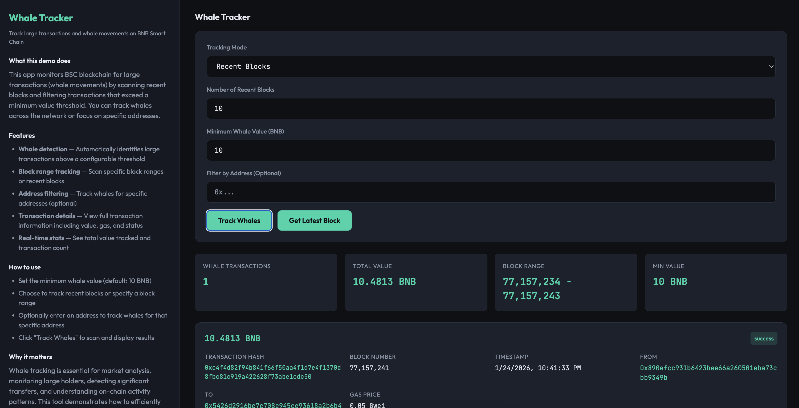

# Whale Tracker

A small BNB Smart Chain (BSC) demo that tracks large transactions (whale movements) by scanning blocks and filtering transactions above a configurable value threshold.



---

## What it does

- **Whale detection** — Automatically identifies large transactions above a configurable threshold (default: 10 BNB)
- **Block range tracking** — Scan specific block ranges or recent blocks for whale transactions
- **Address filtering** — Optionally track whales for specific addresses (from or to)
- **Transaction details** — View full transaction information including value, gas, status, and timestamps
- **Real-time stats** — See total value tracked, transaction count, and block range analyzed

The app connects directly to a public BSC RPC endpoint and demonstrates how to efficiently scan blockchain data to identify and analyze high-value transactions.

---

## Tech stack

- **TypeScript** — App and tests
- **Express** — HTTP server and API endpoints
- **Plain HTML/CSS/JS** — Frontend (dark theme, info + interaction panes)
- **JSON-RPC** — Direct blockchain queries via BSC RPC endpoint

---

## Quick start

### Option 1: Clone and run script (recommended)

```bash
git clone <this-repo>
cd whale-tracker-example
chmod +x clone-and-run.sh
./clone-and-run.sh
```

The script creates a `.env` with a working RPC URL, installs deps, runs tests, and starts the server. Open http://localhost:3000.

### Option 2: Manual

```bash
cd whale-tracker-example
cp .env.example .env   # or create .env with BSC_RPC_URL, PORT, and MIN_WHALE_VALUE_BNB
npm install
npm run build
npm test
npm start
```

Then open http://localhost:3000.

---

## Env vars

| Variable              | Default                          | Description                    |
|-----------------------|----------------------------------|--------------------------------|
| `BSC_RPC_URL`        | `https://bsc-dataseed.bnbchain.org` | BSC JSON-RPC endpoint       |
| `PORT`               | `3000`                           | HTTP server port               |
| `MIN_WHALE_VALUE_BNB`| `10`                             | Minimum transaction value (BNB) to consider a whale |

---

## Usage

1. **Set minimum whale value** — Enter the minimum BNB value threshold (default: 10 BNB)
2. **Choose tracking mode**:
   - **Recent Blocks** — Scan the last N blocks (default: 10)
   - **Block Range** — Specify exact from/to block numbers
3. **Optional address filter** — Enter an address to track whales only for that address
4. **Click "Track Whales"** — The app will scan blocks and display all whale transactions found

---

## API Endpoints

### `GET /api/latest-block`

Returns the latest block number on BSC.

**Response:**
```json
{
  "blockNumber": 35000000
}
```

### `POST /api/track-whales`

Tracks whale transactions in a block range or recent blocks.

**Request body (recent blocks):**
```json
{
  "blockCount": 10,
  "minValueBNB": 10,
  "targetAddress": "0x..." // optional
}
```

**Request body (block range):**
```json
{
  "fromBlock": 35000000,
  "toBlock": 35000010,
  "minValueBNB": 10,
  "targetAddress": "0x..." // optional
}
```

**Response:**
```json
{
  "transactions": [
    {
      "hash": "0x...",
      "blockNumber": 35000000,
      "blockHash": "0x...",
      "timestamp": 1706123456,
      "from": "0x...",
      "to": "0x...",
      "value": "0x...",
      "valueBNB": "10.5",
      "gas": "0x5208",
      "gasPrice": "0x3b9aca00",
      "status": "success"
    }
  ],
  "totalValue": "25.5",
  "blockRange": {
    "from": 35000000,
    "to": 35000010
  },
  "minValueBNB": 10
}
```

---

## Scripts

- `npm run build` — Compile TypeScript to `dist/`
- `npm start` — Run `node dist/app.js`
- `npm test` — Run unit tests (Vitest)
- `npm run dev` — Run with auto-reload (tsx watch)

---

## Project layout

```
whale-tracker-example/
├── app.ts              # Main application (Express server + whale tracking logic)
├── frontend.html       # Frontend UI (dark mode, info + interaction panes)
├── app.test.ts         # Unit tests
├── package.json        # Dependencies and scripts
├── tsconfig.json       # TypeScript configuration
├── vitest.config.ts    # Vitest configuration
├── .env.example        # Environment variables template
├── clone-and-run.sh    # Setup and run script
└── README.md           # This file
```

---

## How it works

1. **Block scanning** — The app fetches blocks from BSC using JSON-RPC `eth_getBlockByNumber`
2. **Transaction filtering** — Filters transactions by:
   - Non-zero value
   - Value above minimum threshold (whale threshold)
   - Optional address match (from or to)
3. **Status checking** — Fetches transaction receipts to determine success/failure status
4. **Aggregation** — Calculates total value and provides statistics

---

## Example use cases

- **Market analysis** — Monitor large transfers to understand market movements
- **Whale watching** — Track specific large holders and their transaction patterns
- **Security monitoring** — Detect unusual large transactions that might indicate issues
- **On-chain analytics** — Analyze high-value transaction patterns on BSC

---

## Notes

- The app uses public BSC RPC endpoints which may have rate limits
- For production use, consider using a dedicated RPC provider
- Large block ranges may take time to process
- Zero-value transactions are automatically excluded
